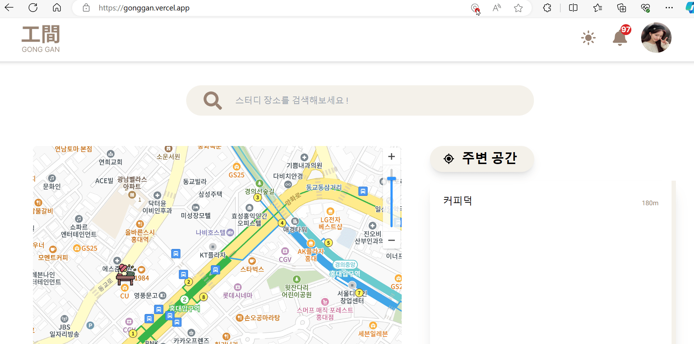
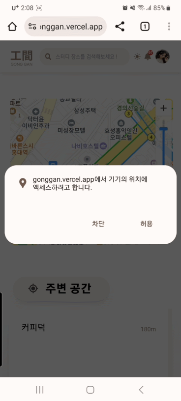
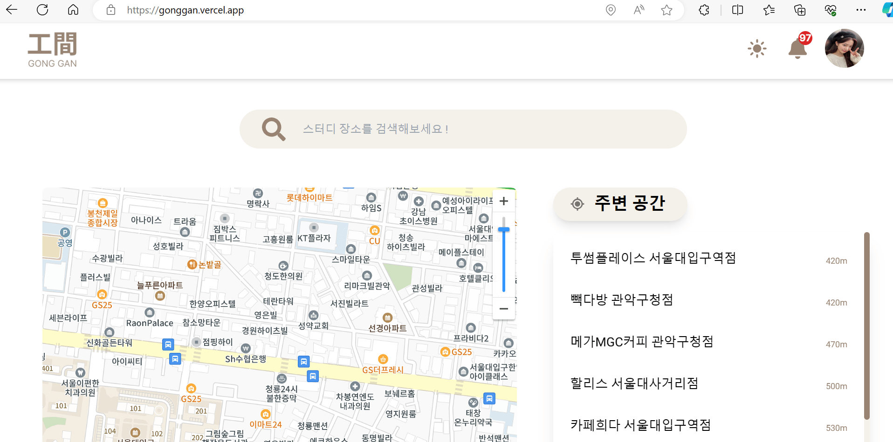
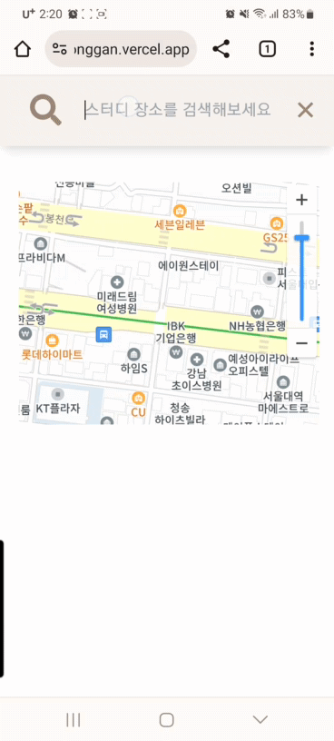
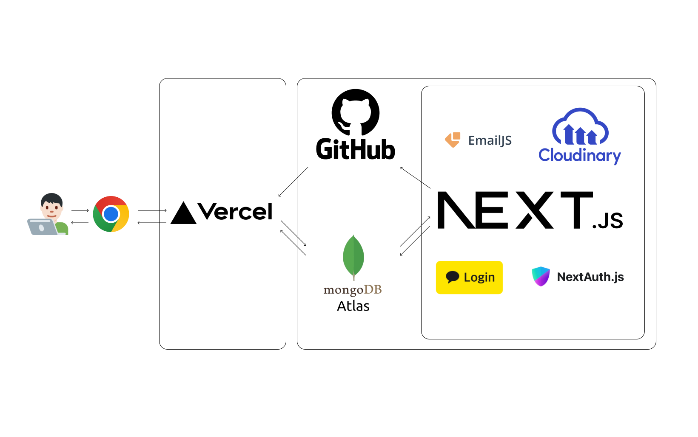
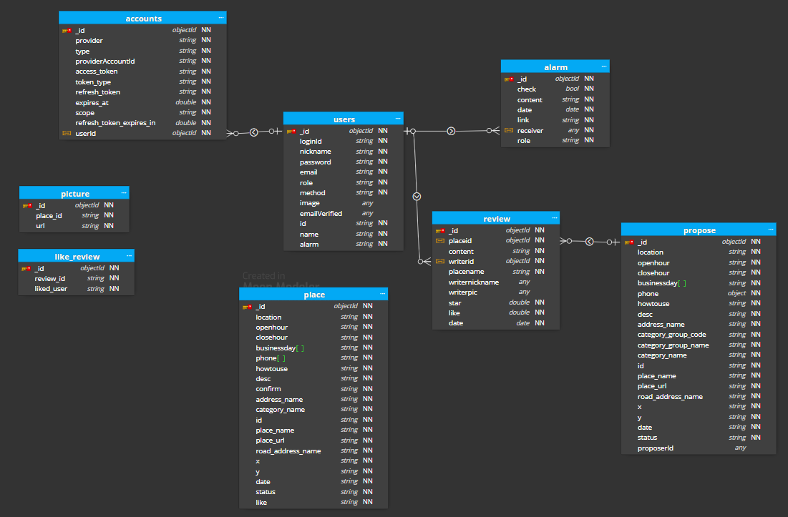

# 🏠내 주변 카공 위치 찾기 !, 工間:study

工間:study 은 사용자에게 카공 위치를 추천해주는 웹 애플리케이션입니다. 
사용자의 지역과 웹사이트 내에서의 활동 내역을 기반으로 하여 
유저들이 추천하고 제안해주신 장소를 추천해줍니다. 

### URL :<a href="https://gonggan.vercel.app/" title="gonggan 이동!"> 工間:study</a> powered by Vercel

## 개발동기

> 카페에서 공부를 하고싶을 때, 매번 네이버나 카카오 지도에서 공부하기 좋은 카페를 찾기가 쉽지 않은 경험이 있습니다. 이에 위치 검색만으로 공부할 수 있는 장소를 한눈에 찾을 수 있다면 새로운 장소를 탐색할 때 느끼는 피곤함을 덜 수 있지 않을까? 또, 분위기 좋은 장소를 공유하면 서로서로 좋지 않을까? 라는 생각으로 프로젝트를 기획하였습니다.

# ✅주요기능

### 위치 기반 주변공간 조회

 

### 장소 찾기

### 장소 제안하기

# 🔍프로젝트 프로세스

# 🛠️ Skills

### 철학

> 공간:study는 혼자서 진행하는것이 아닙니다. 따라서 최대한 간결하고 직관성 높은 코드 작성으로 코드의 재 사용성을 높였습니다. 코드 뿐만이 아닌 지속적인 커뮤니케이션으로 업무의 진척상황과 고민사항을 공유하여 함께 해결하는것을 목표로 삼았습니다.

### TypeScript

> TypeScript를 사용하면 데이터베이스의 모델 및 쿼리를 작성할 때 타입을 명시적으로 정의할 수 있습니다. 이는 데이터베이스 스키마와의 일관성을 유지하고 데이터베이스 관련 코드의 가독성을 높일 수 있습니다. Next.js기능으로 많은 api를 작성하였는데, 명시적으로 입력값과 출력값을 확인하여 런타임 오류를 줄이기 위해 TypeScript를 채택하였습니다.

### React.js

> React.js를 사용하여 개발된 웹 애플리케이션은 뛰어난 사용자 경험을 제공합니다. React는 가상 DOM(Virtual DOM)을 사용하여 페이지의 일부만 업데이트하므로 전체 페이지가 다시 로드되지 않고도 빠르게 상호작용할 수 있습니다. 장소를 검색하고 즉시 유저에게 피드백을 주어야하는 기능이 중요하였기 때문에 React.js를 채택하였습니다.

### Recoil

> 전역상태관리 라이브러리는 꼭 필요한 곳에만 사용하고싶었습니다. 그래서 이 프로젝트는 지도의 위도,경도와 다크모드를 구현하는 것에만 사용하였습니다. Recoil은 간단하고 직관적인 API를 제공하여 상태 관리를 쉽게 할 수 있습니다. 특히 Atom 기법은 직관적으로 상태의 흐름을 파악 할 수 있었고 상대적으로 러닝커브가 짧아 Recoil을 채택하였습니다.

### Next.js

> Next.js는 서버 사이드 렌더링과 정적 사이트 생성을 지원합니다. 이를 통해 초기 로딩 속도를 개선하고 사용자에게 보다 나은 사용자경험을 제공할 수 있었습니다. Next.js는 기본적으로 React 기반으로 동작하며, 강력한 개발 도구와 함께 제공합니다. 이 프로젝트는 백엔드 개발자가 없기 때문에 프론트엔드를 위한 API를 프론트엔드 개발자가 구현할 때 간단하게 구현 할 수 있었습니다.

### Tailwind css

> 저희의 철학은 협업에 중점되어있습니다. CSS를 작성하기위해 사전에 네이밍작업을 할 필요도 없었으며. Tailwind css의 코드작성법은 HTML태그의 클래스네임에 작성된 클래스만을 확인하여 다른 사람이 작성한 코드도 쉽게 이해 할 수 있었기에 Tailwind css를 채택하였습니다.

### MongoDB

> MongoDB는 JSON과 유사한 BSON(Binary JSON) 형식을 사용하여 데이터를 저장합니다. 이는 자바스크립트 객체와 유사한 형태로 데이터를 저장하고 조회할 수 있어 프론트엔드 개발자로 구성된 인원이 데이터를 이해하고 다루는 데 편리하여 MongoDB 를 채택하였습니다.

### Vercel 배포

> Vercel은 Next.js의 공식 호스팅 플랫폼으로, Next.js와의 시너지를 최대화하여 빠르고 안정적인 배포를 제공합니다. GitHub, GitLab, Bitbucket 등과 같은 버전 관리 시스템과의 통합을 제공하여 코드 변경 사항이 발생할 때 자동으로 배포를 수행할 수 있습니다. 공간:study는 GitHub를 사용하여 버전을 관리하였고, 손쉽게 CI/CD를 구축할 수 있었기에 Vercel을 채택하였습니다.

### kakao 로그인

> Kakao 로그인을 통해 사용자는 별도의 계정을 만들지 않고도 편리하게 로그인할 수 있습니다. 이는 사용자에게 불편함 없이 애플리케이션에 로그인할 수 있는 기회를 제공할 수 있기에 kakao 로그인을 채택하였습니다.

### cloudinary

> Cloudinary는 글로벌 CDN(Content Delivery Network)을 통해 빠르고 안정적인 이미지 및 비디오 전송 서비스를 제공하고, 최근 Next.js와의 긴밀한 협업을 진행하였기에 향후 Next.js 와의 기능향상을 기대하며 cloudinary를 채택하였습니다.

# 📜ERD

# 🛠️이슈

> 검색 기능을 구현하면서 동시에 검색 결과를 자동완성 창에 띄우고자 했지만, MongoDB와 Kakao API를 사용하다가 가끔씩 429 에러(사용자가 주어진 시간 동안 너무 많은 요청을 보냈음)가 발생했습니다. 
> 이 문제를 해결하기 위해 디바운스 커스텀 훅스를 개발하여, 단어 입력 후 300ms 이내에 다시 입력이 발생하면 최종 검색어를 초기화하고, 300ms 이후에 최종 검색어를 API 서버로 전송하도록 설계했습니다. 이를 통해 429 에러가 더 이상 발생하지 않았을 뿐만 아니라, 서버 부하도 감소하는 효과를 얻을 수 있었습니다. 
> 이 경험을 통해 프론트엔드 개발 뿐만 아니라 백엔드 고려를 통한 효율적인 문제 해결 능력을 강화하게 되었습니다. 항상 사용자 경험을 개선하고 서비스의 안정성을 고려하여 개발하는 데에 주력하고 있습니다.

> 사용자가 사진을 업로드할 때 발생하는 로딩 시간 문제를 해결하는 데 중점을 두었습니다. 기존에는 사진 파일 자체를 데이터베이스에 직접 저장하는 방식을 사용하다보니 로딩이 매우 느렸습니다. 
> 이 문제를 해결하기 위해 클라우드 스토리지를 활용하여 업로드된 사진 파일을 먼저 저장하고, 해당 사진의 링크만을 데이터베이스에 저장하는 방식으로 변경하였습니다. 이로써 사용자가 입력한 사진을 빠르게 화면에 보여줄 수 있게 되었고, 동시에 매우 큰 용량의 사진 파일을 간단한 링크로 대체함으로써 데이터베이스의 용량을 효율적으로 활용할 수 있었습니다. 
> 이를 통해 데이터베이스에 사진 파일을 직접 저장하는 방식과 클라이언트 측에서의 base64 인코딩 활용을 경험했습니다. 또한, 제한된 자원을 최대한 활용하는 창의적인 해결책을 찾는 과정에서 더 깊이 생각하는 기회가 되었습니다. 항상 효율성과 사용자 경험을 개선하는 방향으로 개발에 전념하고 있습니다.

# 👩‍💻개발자

- 주지찬 (<a>https://github.com/jcdororo</a>)
- 정화윤 (<a>https://github.com/hwadong119</a>)
